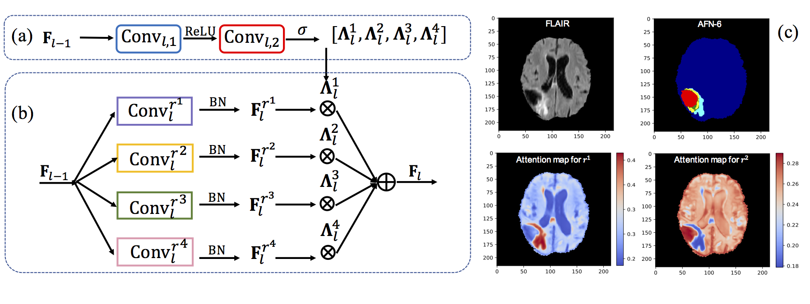
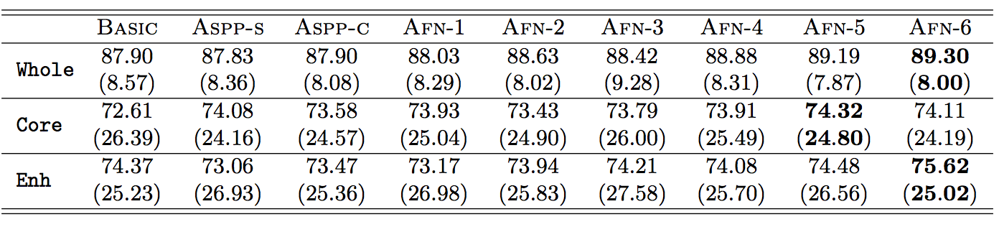

# Autofocus Layer for Semantic Segmentation

## Introduction
This is a PyTorch implementation of the autofocus convolutional layer proposed for semantic segmentation with the objective of enhancing the capabilities of neural networks for multi-scale processing.
Autofocus layers adaptively change the size of the effective receptive field 
based on the processed context to generate more powerful features.
The proposed autofocus layer can be easily integrated into existing networks to improve a model's representational power. 

Here we apply the autofocus convolutional layer to deep neural networks for 3D semantic segmentation. We run experiments on the [Brain Tumor Image Segmentation dataset (BRATS2015)](https://www.smir.ch/BRATS/Start2015) as an example to show how the models work. In addition, we also implement a series of deep learning based models used for 3D Semantic Segmentation. The details of all the models implemented here can be found in our paper: [Autofocus Layer for Semantic Segmentation](https://arxiv.org/pdf/1805.08403.pdf).



Figure 1. An autofocus convolutional layer with four candidate dilation rates. (a) The attention model. (b) A weighted summation of activations from parallel dilated convolutions. (c) An example of attention maps for a small (r^1) and large (r^2) dilation rate. The first row is the input and the segmentation result of AFN6. 

## Citation
If you find the code or the models implemented here are useful, please cite our paper:

[Autofocus Layer for Semantic Segmentation](https://arxiv.org/pdf/1805.08403.pdf). 
[Y. Qin](http://cseweb.ucsd.edu/~yaq007/), K. Kamnitsas, S. Ancha, J. Nanavati, G. Cottrell, A. Criminisi, A. Nori, MICCAI 2018.

## Data

You can download the full dataset with training and testing images from https://www.smir.ch/BRATS/Start2015. To run all the models here,
you need to do a series of data pre-processing to the input images. 
- Provide a mask including the Region of Interest (RoI) as one of the input image. For example, in the BRATS dataset, the region outside the brain should be masked out with the provided mask.
- The intensity of the data within the RoI must be normalized to be zero-mean, unit-variance. For the BRATS dataset, each image must be normalized independently other than doing the normalization with the mean and variance of the whole training dataset.
- Make sure the ground-truth labels for training and testing represent the background with zero. For example, we have four different 
classes in the BRATS dataset, then the number of classes in this dataset will be 5, including the background (```[--num_classes 5]```) and number zero will be used to represent the background.
- When you use the training code for your own data, please change the data path correspondingly.

We provide the example codes for data preprocessing, including converting the data format, generating the masks and normalizing the input image. The corresponding text file is also provided to show the directory where the image are saved. You can create your own text file to save the image data path and change the corresponding code in the python scripts. The data normalization code is mainly derived from [DeepMedic](https://github.com/Kamnitsask/deepmedic).

A small subset of the BRATS dataset (after all the above data pre-processing) is provided [here](http://cseweb.ucsd.edu/~yaq007/dataset.zip) to run the preset examples. 

## Supported Models
Please refer "[Autofocus Layer for Semantic Segmentation](https://arxiv.org/pdf/1805.08403.pdf)" for the details of all the supported models.
- Basic Model: half pathway of [DeepMedic](https://arxiv.org/abs/1603.05959) with the last 6 layers with dilation rates equal 2.
- ASPP-c: adding an [ASPP](https://arxiv.org/abs/1606.00915) module on top of Basic model (parallel features are merged via concatenation).
- ASPP-s: adding an [ASPP](https://arxiv.org/abs/1606.00915) module on top of Basic model (parallel features are merged via summation).
- AFN1-6: with the last 1-6 dilated convolutional layers replaced by our proposed aufofocus convolutional layer.

## Performance

The performance reported here is an average over three runs on the 54 images from BRATS 2015 dataset. All the trained models can be downloaded [here](http://cseweb.ucsd.edu/~yaq007/models.tar.gz).

Table 1: Dice scores shown in format mean (standard deviation).

## Environment

The code is developed under the follwing configurations.
- 1-3 GPUs with at least 12G GPU memories. You can choose the number of GPUs used via ```[--num_gpus NUM_GPUS]```.
- ```PyTorch 0.3.0``` or higher is required to run the codes. 
- ```Nibabel``` is used here for loading the NIFTI images. 
- ```SimpleITK``` is used for saving the output into images. 

### Installation
``` bash
git clone https://github.com/yaq007/Autofocus-Layer.git
conda install pytorch torchvision -c pytorch
pip install nibabel
pip install SimpleITK
```

## Quick Start
First, you need to download the provided subset of BRATS dataset and all the trained models. Please run
``` bash
chmod +x download_sub_dataset.sh
./download_sub_daset.sh

chmod +x download_models.sh
./download_models.sh
```
Then you can run the following script to choose a model and do the testing. Here we use AFN1 as an example.
```bash
python test.py --num_gpus 1 --id AFN1 --test_epoch 390 
```
You can change the number of used GPUs via ```[--num_gpus NUM_GPUS]``` and choose the tested model that you want via ```[--id MODEL_ID]```. Make sure the test epoch is included in the downloaded directory "saved_models".

You can check all the input arguments via ```python test.py -h```.

## Training
In the provided subset of dataset, we also provided 20 example images for training. You can start training via:
```bash
python train.py --num_gpus NUM_GPUS --id MODEL_ID 
```
For the models like "Basic", you may only need one gpu to run the experiments. For the models like "AFN6", you may need to increase the number of GPUs to be 2 or 3. This depends on the GPU memory that you are using. Please check all the input arguments via ```python train.py -h```.

## Evaluation
You can evaluate a series of models saved after different epochs for one network via.
```bash
python val.py --num_gpus NUM_GPUS --id MODEL_ID 
```
Please make sure that you have already provided a validation list in order to load the validation images. You can specify the steps of epochs that you want to evaluate. Please check all the input arguments via ```python val.py -h```.

## Testing
### Case 1
If you have labels for test data and want to see the accuracy (e.g., Dice score for BRATS dataset), you can use the following two testing codes:
- ```test.py``` The input of the network are small image segments as in the training stage.
- ```test_full.py``` The input of the network is a full image rather than a smaller image segment.

There are small differences of these two different testing methods due to the padding in the convolutions. For the performance that we report above, we use the ```test.py``` to get all the results. 

To test, you can simply run 
```bash
python test.py/test_full.py --num_gpus NUM_GPUS --id MODEL_ID --test_epoch NUM_OF_TEST_EPOCH
```

You can increase the number of GPUs to speed up the evaluation process. You can also use ```--visualize``` action to save the prediction as an output image.

### Case 2
If you do not have ground truth for test data, you should use ```test_online.py``` to do the testing and save the output. For the BRATS dataset, you can simply run the following script to generate the predicted images and submit them to the online evaluation server.

```bash
python test_online.py --num_gpus NUM_GPUS --id MODEL_ID --test_epoch NUM_OF_TEST_EPOCH --visualize
```
Note! If you want to run ```test_online.py``` on the provided sample testing images, you need to change the directory of data when loading images.

## Contact
If you have any problems when using our codes or models, please feel free to contact me via e-mail: yaq007@eng.ucsd.edu.
